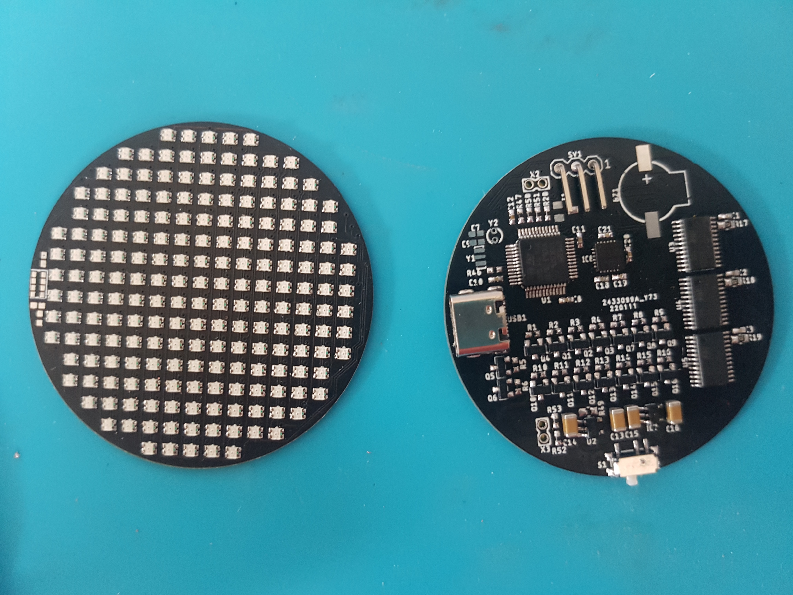
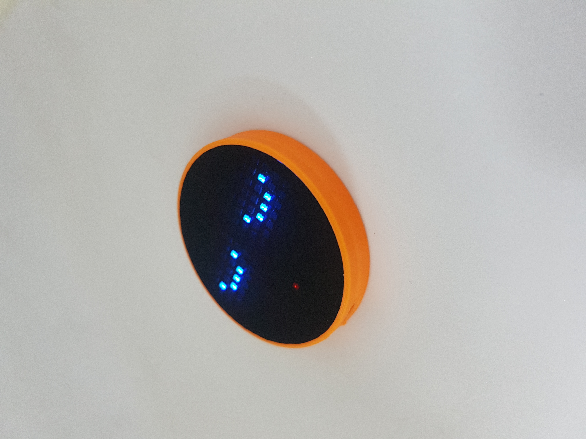

# EMOTIC - LED Matrix RGB Emoticon Player STM32F103C8T6

Proyek ini menampilkan ekspresi/emoticon pada **LED matrix RGB** menggunakan mikrokontroler **STM32F103C8T6**. **EMOTIC** dapat berganti secara otomatis bila digerak gerakkan.

## Fitur

- Menampilkan berbagai ekspresi/emoticon pada LED Matrix RGB (misalnya: senyum, sedih, tertawa, marah)
- Terdapat mini games, berupa maze game, snake game, dan falling sand
- Jika lapar, **EMOTIC** akan menampilkan animasi lapar dan pengguna harus menggerakkannya untuk memilih makanan yang tersedia (semangka, lemon, kiwi, telur, pizza, dan burger) lalu gerakkan terus menerus sampai makanan habis
- **EMOTIC** akan tertidur jika tidak dimainkan, dan jika digerakkan makan ia akan terbangun
- Dapat dilakukan pengisian ulang baterai melalui USB Type C jika **EMOTIC** sudah merasa lelah
- Pengendalian melalui gerakan dengan memanfaatkan sensor accelerometer dan gyro
- Implementasi menggunakan STM32F103C8T6

## Tampilan Hardware

Berikut gambar rangkaian/PCB/hasil rakitan:

## Cara Penggunaan

1. Buka project di STM32CubeIDE
2. Hubungkan dengan ST-Link V2
3. Build
4. Flash via ST-Link

Created by [Moh Sirojudin Munir]
